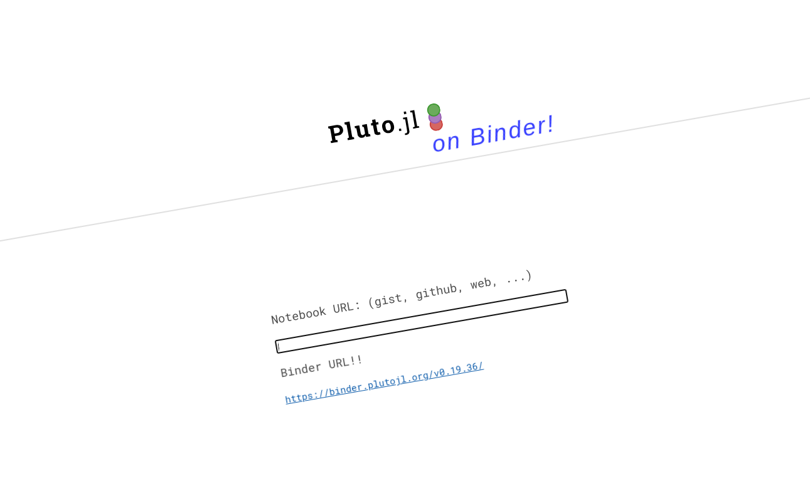
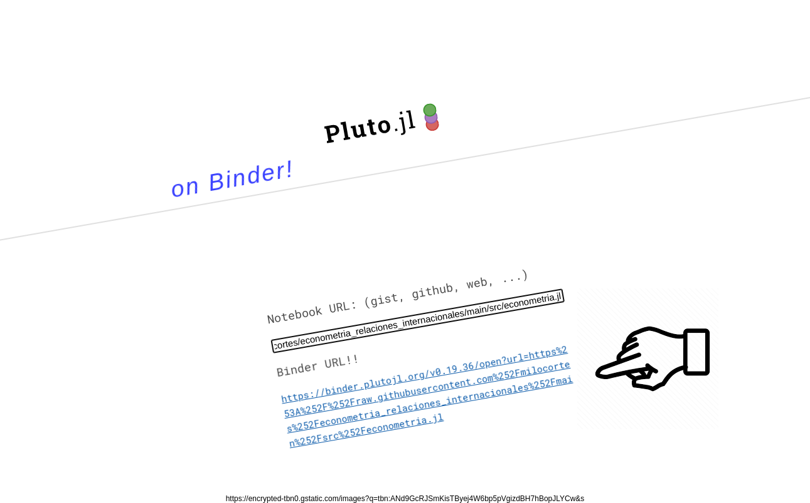

# Seminario de titulación en Relaciones Internacionales

* Maestría en Asuntos Internacionales
* Universidad Anáhuac México
* Clase: Métodos econométricos en las Relaciones Internacionales

## Ejecución del Notebook de Pluto

Ve a la siguiente dirección:

https://pluto-on-binder.glitch.me/





Copia y pega la siguiente dirección en el sitio anterior:

```
https://raw.githubusercontent.com/milocortes/econometria_relaciones_internacionales/main/src/econometria.jl
```


Abre la ruta que se genera en el sitio de binder


